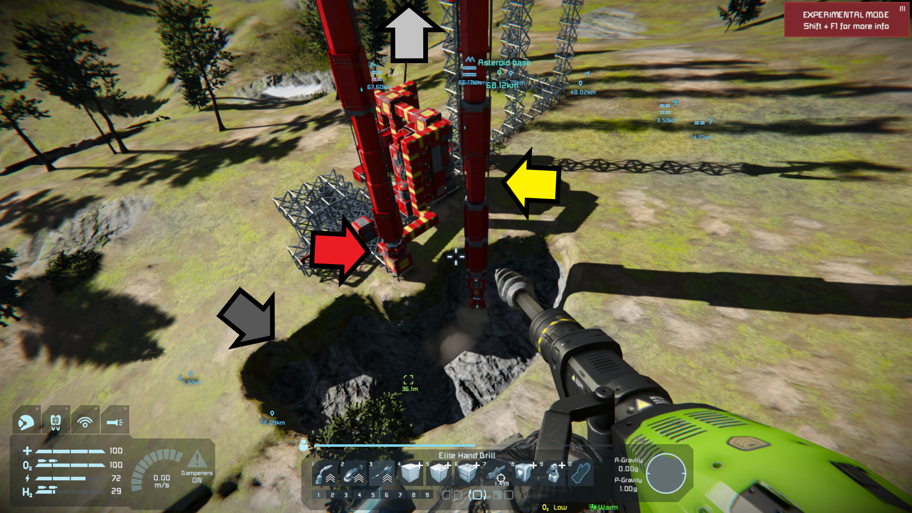

# DrillingRig.cs

This script provides automation of a drilling rig.

Use it to quickly plop down a drilling rig connected to a refinery and some storage, and come back later for the ingots.

## Rigs explained 

The drilling rig is composed of five sections. To see how these pieces connect, observe the four arrows in the below screenshot.

Listed in build order:
- Advanced Rotor at the base, used to swing the drill in an arc. (see red arrow in screenshot)
  Notes: (1) Use Advanced Rotor, as the regular rotor will not convey drilled materials.
         (2) Leave room under it to connect a conveyer. Placing it atop a conveyer junction is best.)
- Lift Arm, composed of m * Lift Pistons, attached to the rotor, facing upward. As the name implies, these raise the rest of the rig.
- A Distance Piston, connected to the top Lift Piston via conveyor junction or curved conveyer. This will move the drill outward, providing our second dimension. (light grey arrow is pointing at where it should be)
  Note: I've been using a single distance as I expect adding a second will cause the rig to fall apart. This will require some experimentation.
- Drill Arm, n * Drill Pistons, similarly connected to the attachment of the Distance piston, facing downward- our third dimension. The more drill pistons, the deeper you can go. (yellow arrow)
- Drill Head, attached to the lowest Drill Piston (see tip of the hand drill). See drill heads section.

The dark grey arrow is pointing at the material which this rig has removed. A great big happy smile.

You may need (or want) to add extra lift pistons to allow for going even deeper. You'll need at least enough to ensure the drill can move across the entire surface area being removed.

Setting the rotor's minimum and maximum angle allows you control over the two boundary.

Except for the rotor component, a demonstration of this type of rig can be seen in [part #5 of Splitsie's excelent tutorial series](https://www.youtube.com/watch?v=knRgN0WhzKg&list=PLfMGCUepUcNzLePdu3dZfMTLfWq1bclUK&index=5).

## Usage:
* Modify constants in NAME_DRILL_PISTONS, NAME_LIFT_PISTONS, NAME_DISTANCE_PISTON, NAME_ROTOR to the names of your blocks
* Optional - if you want to use an LCD screen, also modify NAME_LCD to match your block
* Modify the PREFIX_ constants to match text in your blocks (you may need to rename your blocks)
* Enter your modified code a programmable cube. 
* Program your rotor with upper and lower angle bounds; move the rotor to within those bounds. Set the RPM (ideally no higher than 2.0)
* Set the desired velocity on your pistons (up to 0.3 should avoid punching the ground)
* Turn on the programmable cube.

## Tips:
* On high-gravity bodies you'll want to have drills be as perpendicular to gravity as possible. This is to avoid angering Klang by adding unnecessary complexity to your rig. An extended distance piston could become a lever and counter your rotor's torque.
* Limit your Lift Arm to two pistons. I've seen catastrophic failures caused by a third.
* To avoid excessive sway you may get better results by using "shared inertia" on the lift arm as well as separately the drill arm. Select all the pistons on an arm and then press the "shared inertia" button.

## Future Development:
* Tune default values for swings, velocities (either hard-code, or perhaps dynamically using m & n).
** Later on auto-tune the rig.
* Auto-detect drilling rigs? (easy when a single rig is on the current grid, might be able to use subgrids off a rotor, or follow Isy's method of using groups)
* Support multiple Distance Pistons? (Would such a construct even be stable?)
* Ore output? How about calculating an ETA?
* Theoretically this program should support small grid drilling rigs, but this has not yet been tested.
* Damage detection and safety shutdown.

If you have any ideas or feature requests, I'd love to hear them.

## Drill Heads
I started out with a single drill attached directly to the lowest drill piston. That worked fine, but was slow.

Here are some variants I tried or want to try:

### Cross-shaped drills
A junction is attached to the lowest drill piston, with drills hanging off Curved Conveyor Tubes.

With upgrades added in v0.40 and a cross-shaped drill-head I managed to get a rig (2 Lift/5 Drill) running fairly well at 4 RPM. The conveyers failed at 5 RPM.

Possible improvement: remove the conveyer tubes. Either attach the drills directly to the junction, or replace the tubes with junctions.

### Square-shaped drills
Untested. Similar to cross-shaped drills, but drills are affixed to the corners of the 3x3 box surrounding the piston.

### Rotating drill head
Untested. Hypothesis: avoids the problem of a drill missing a section due to speed and hitting it later on. Not sure how fast I'd need to rotate the advanced rotor.

### If I can't build a perfect drill head...
#### Damage detection
Damage will probably creep in. If I ever get to the point that material stops flowing from a drill, it can be considered too damaged to continue (the extra weight will throw off the rotor; also there's limited storage anyway and we don't want to lose precious metals). The reason for looking at material is because parts other than the drill tend to get damaged (piston tops aren't quite rugged enough for the rigors of a rig). If material stops flowing, hit the emergency shut down (lock the rotor and turn off programmable block - in that order)

#### Self-repairing
Untested. Just a crazy idea I might try. If I can't avoid damage, maybe I can mitigate it. None of the parts are too expensive if refining the stone.

## Extra credit: Geometry lesson

### Q: What shape is the area we are going to be drilling?

The technical name for the surface shape being cut isn't actually "great big smile". Rather, it's an *"Annular Sector"*, being a sector (i.e. part of) of the ring between two *concentric cylinders* (which is called an *"Annulus"*). See [this page](https://www.aqua-calc.com/calculate/area-annulus) for a diagram, area calculator, and the area formula of an annular sector.

But... we'll also be drilling to a depth, which means multiplying this area by height to attain the total volume being excavated.

In plainer terms, this means we are drilling out the area between two arcs-
- one whose radius is the sum of a rotor's radius and the length of a retracted piston (TODO: calculate this)
- the second being the above, plus the extension length of the distance piston (10m on large grid)

And as we are drilling down to a depth defined by the total extension length of the lift+drill pistons (m + n),
minus the height of the rotor off the ground, adjusting as necessary for non-flat terrain.

Final note for fellow pedants: this isn't perfectly accurate, as the drill will be extracting material both outside the angle defined by the rotor, as well as outside the outer radius and inside the inner radius.)

((Note to self: test this volume and compare to the removed material dumped into a large container with no refinery. Remember: 1 cubic meter = 1000 liters)).
